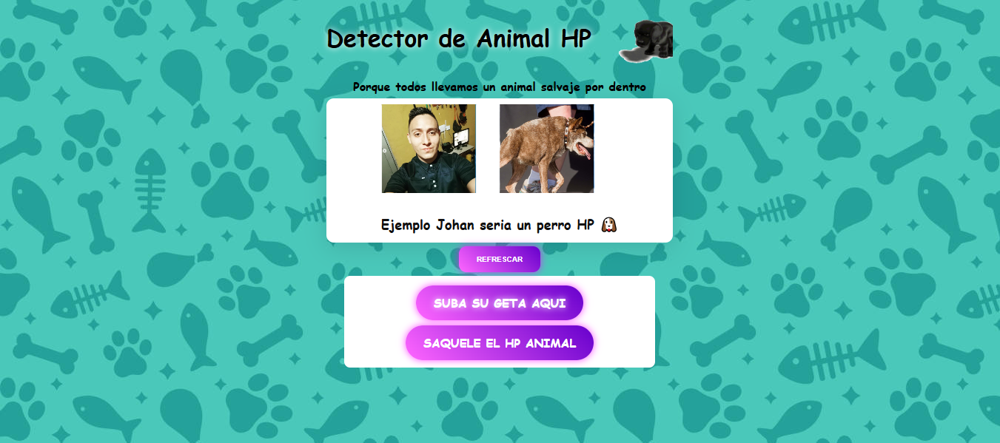
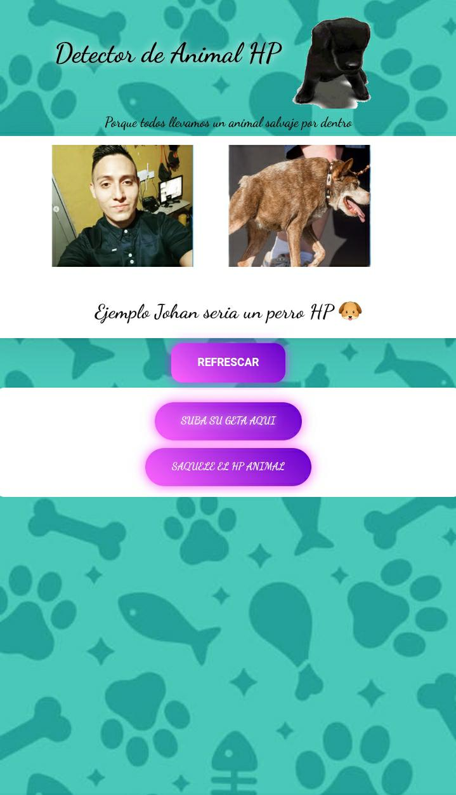

# 🐵 Detector de Animal HP  

Una aplicación divertida desarrollada con **HTML, CSS y JavaScript** que detecta qué **animal HP** llevas dentro.  
Solo sube tu foto y el detector te dirá cuál es tu versión animal con un toque **grosero y colombiano**.  

---

## 🚀 Demo en Vivo  
👉 [Prueba el detector aquí](https://joganyt01.github.io/Detector-H/)  

---

## 📸 Capturas del detector  

<table>
  <tr>
    <td align="center"><b>Desktop</b></td>
    <td align="center"><b>Móvil</b></td>
  </tr>
  <tr>
    <td></td>
    <td></td>
  </tr>
</table>  

---

## ✨ Características  

- 📷 Subida de foto desde tu dispositivo.  
- 🐶 Detecta tu **animal HP** aleatorio con foto + nombre grosero + emoji.  
- 🔄 Botón de reinicio para volver a intentarlo.  
- 🎨 Animaciones con CSS para mostrar resultados de forma divertida.  
- 😂 Humor colombiano y frases groseras incluidas.  
- 📱 Compatible con móvil y escritorio (responsive con Flexbox/Grid).  

---

## 🛠️ Requisitos  

- Navegador moderno (Chrome, Edge, Firefox, Safari).  
- Permitir subir una imagen desde tu galería o cámara.  

---

## 👨‍💻 Autor  

Desarrollado con ❤️ por **Johanyt**  
